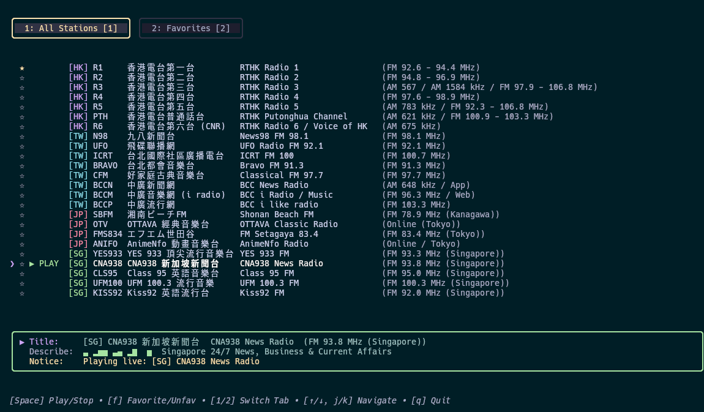

# 📻 Asia Internet Radio TUI (HK • TW • JP • SG)

A lightweight, full-screen Terminal User Interface (TUI) internet radio player written in Go using [Bubble Tea](https://github.com/charmbracelet/bubbletea) and [Lip Gloss](https://github.com/charmbracelet/lipgloss). Features MPRIS2 D-Bus integration, multi-region live streams, and persistent favorites.


---

## ✨ Features

- **Full-Screen TUI**: Responsive layout with column alignment for East Asian (CJK) characters.
- **Regions & Stations**:
  - 🇭🇰 **Hong Kong (RTHK)**: Radio 1, Radio 2, Radio 3, Radio 4, Radio 5, Putonghua, Radio 6 (CNR).
  - 🇹🇼 **Taiwan**: News98 (九八新聞台), UFO Radio (飛碟聯播網), BCC News / Music / Pop (中廣), ICRT, Bravo FM 91.3, Classical FM 97.7.
  - 🇯🇵 **Japan**: Shonan Beach FM, OTTAVA Classical, FM Setagaya 83.4, AnimeNfo Radio.
  - 🇸🇬 **Singapore**: YES 933, CNA938, Class 95, UFM 100.3, Kiss92.
- **MPRIS2 D-Bus Support**: Control playback, browse tracks, and inspect stream metadata using hardware media keys, `playerctl`, or desktop bars (Waybar, Polybar, GNOME, KDE).
- **Two-Tab System**:
  - `[1] All Stations`
  - `[2] Favorites` (persisted to `~/.config/iradio/favorites.json`)
- **Live Signal Visualizer**: Animated terminal equalizer responding to playback state.

---

## 📋 Prerequisites

An external media streaming backend is required (`mpv` is recommended for low latency HLS/AAC streams):

- **Debian / Ubuntu / Raspberry Pi OS**:
  ```bash
  sudo apt install mpv
  ```
- **Arch Linux**:
  ```bash
  sudo pacman -S mpv
  ```
- **macOS** (via Homebrew):
  ```bash
  brew install mpv
  ```

*(If `mpv` is not installed, the player automatically falls back to `ffplay`).*

---

## 🚀 Quick Start

### Run Directly
```bash
go run main.go
```

### Build with Makefile
```bash
# Build binary for current host
make build

# Run built binary
./dist/iradio

# Cross-compile for Linux and macOS (amd64 & arm64)
make build-all
```

---

## ⌨️ Keybindings

| Key | Action |
| :--- | :--- |
| `Space` | Play / Stop selected station |
| `1` | Switch to **All Stations** tab |
| `2` | Switch to **Favorites** tab |
| `Tab` | Toggle between tabs |
| `f` | Add / remove highlighted station to **Favorites** |
| `↑` / `k` | Navigate selection up |
| `↓` / `j` | Navigate selection down |
| `q` / `Ctrl+C` | Stop audio and quit |

---

## 🎛️ MPRIS2 Media Control (Linux)

While the player is running, control it from scripts, media hotkeys, or terminal via `playerctl`:

```bash
# Check current playback status
playerctl -p rthk status

# View station metadata (broadcaster, dial, station title)
playerctl -p rthk metadata

# Play/Pause toggle
playerctl -p rthk play-pause

# Next / Previous station
playerctl -p rthk next
playerctl -p rthk previous
```

---

## 📁 File Structure

- `main.go`: Main Bubble Tea application, MPRIS2 service, and station list.
- `Makefile`: Cross-compilation tasks for Linux and macOS.
- `~/.config/iradio/favorites.json`: Station favorites state.

